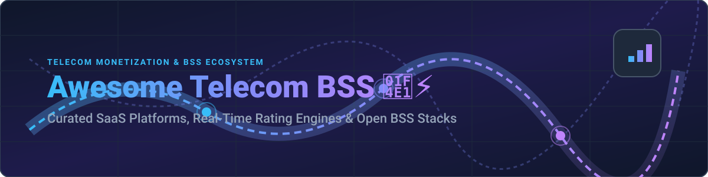

  

# Awesome Telecom BSS 📡⚡

  
  
  
  
  

## 🌐 Top Telecom BSS Tools & Monetization Ecosystem

**Curated List of Enterprise SaaS Platforms & Open-Source GitHub Projects** 🚀  
*Focused on Telecom Business Support Systems (BSS), Real-Time Billing, Charging Engines (OCS), Revenue Management, Mediation & 5G Monetization* 📱💳

---

### 💡 Overview & Scope

This repository tracks notable **SaaS platforms** and **open-source projects** for **Telecom BSS (Business Support Systems)**. These systems handle converged rating, real-time charging (OCS), CDR mediation, invoicing, customer experience (CRM), order management, and revenue assurance for communications service providers (CSPs), mobile virtual network operators (MVNOs), and digital telcos.

- 🏆 **Enterprise Leaders**: Amdocs, Ericsson, Oracle Communications, Netcracker, CSG, Comarch, Sterlite (STL), Hansen, Optiva, and DigitalRoute.
- 🔓 **Open-Source Stacks**: Real-time rating engines, 3GPP DIAMETER/RADIUS Online Charging Systems (OCS), CDR mediation engines, softswitches, and usage-based metering platforms.

Contributions are welcome! Open a Pull Request to add or update entries. 🤝

---

## 📑 Table of Contents

- [🏢 SaaS/Hosted Platforms](#-saashosted-platforms)
- [🔓 Open-Source GitHub Projects](#-open-source-github-projects)
- [🛠️ Additional Open-Source Options](#%EF%B8%8F-additional-open-source-options)
- [🤝 How to Contribute](#-how-to-contribute)
- [⚠️ Disclaimer](#%EF%B8%8F-disclaimer)
- [📈 Star History](#-star-history)

---

## 🏢 SaaS/Hosted Platforms

*Sorted by company scale (Annual Revenue / Valuation descending)* 📊

| Product | Company Size / Revenue | Description | Pricing | Free Tier / Trial Limit |
| :--- | :--- | :--- | :--- | :--- |
| **[Ericsson Billing / Digital BSS](https://www.ericsson.com/)** 📶 | ~$25.0 Billion / Tier-1 Global Telecom Giant | Converged charging and billing solutions tightly integrated with network capabilities for 5G, IoT, and multi-service monetization. | Request for Quote (Modular carrier pricing, contact sales) | No free trial available; consultation upon request |
| **[Oracle Communications](https://www.oracle.com/industries/communications/)** 🔴 | ~$53.0 Billion (Parent Oracle) / $400B+ Market Cap | Carrier-grade Billing and Revenue Management (BRM) suite supporting high-scale charging, mediation, invoicing, and 5G monetization. | Request for Quote (Enterprise license negotiation, contact sales) | No free trial available; OCI free tier available for cloud infrastructure |
| **[Amdocs](https://www.amdocs.com/)** 💼 | ~$4.9 Billion Revenue / ~$10B Market Cap | Market-leading end-to-end BSS portfolio for Tier-1 operators, covering revenue management, customer experience, catalog, and cloud-native monetization. | Request for Quote (Enterprise custom contracts, contact sales) | No free trial available; custom demo upon request |
| **[Netcracker](https://www.netcracker.com/)** 🌐 | ~$1.2 Billion Revenue / Subsidiary of NEC ($25B+) | Cloud-native Digital BSS/OSS suite focused on monetization, customer experience, and partner ecosystem management for large carriers. | Request for Quote (Enterprise custom licensing, contact sales) | No free trial available; custom demo upon request |
| **[CSG](https://www.csgi.com/)** 💳 | ~$1.17 Billion Revenue / ~$1.5B Market Cap | Revenue management and monetization platform strong in real-time billing, payments, and digital/MVNO environments, particularly in North America. | Request for Quote (Enterprise custom pricing, contact sales) | No free trial available; live demo upon request |
| **[Comarch Telecom](https://www.comarch.com/)** 🇪🇺 | ~$450 Million Revenue | Modular BSS and OSS platform offering billing, CRM, product catalog, and operations support for European and global operators. | Request for Quote (Scalable pay-as-you-grow pricing, contact sales) | No free trial available; custom demo upon request |
| **[Hansen Technologies](https://www.hansen.com/)** ⚡ | ~$220 Million Revenue | Billing, customer care, and revenue management solutions for telecom, utilities, and communications providers. | Request for Quote (Enterprise custom contracts, contact sales) | No free trial available; live demo upon request |
| **[Sterlite Technologies (STL)](https://www.stl.tech/)** 📡 | ~$650 Million Revenue | Digital BSS and network solutions supporting telecom operators with monetization and transformation capabilities. | Request for Quote (Enterprise custom pricing, contact sales) | No free trial available; demonstration upon request |
| **[DigitalRoute](https://www.digitalroute.com/)** 🔄 | ~$80 Million Revenue | Usage data management and mediation platform that collects, processes, and monetizes usage events for billing and analytics. | $1,750 USD/month starting tier (Salesforce AppExchange integration); Enterprise platform by custom quote | 3-month trial available for select Early Adopter programs; no standard free trial |
| **[Optiva](https://www.optiva.com/)** ☁️ | ~$50 Million Revenue | Cloud-native BSS platform specialized in real-time charging, billing, and digital monetization for modern telcos and MVNOs. | Request for Quote (Enterprise custom pricing, contact sales) | No free trial available; custom demo upon request |

---

## 🔓 Open-Source GitHub Projects

*Sorted by GitHub Star Count descending* ⭐

- **[Kill Bill](https://github.com/killbill/killbill)**  🌟  
  Modular open-source billing and payment platform supporting subscriptions, usage-based charging, and extensible plugins.

- **[Kamailio](https://github.com/kamailio/kamailio)**  ⚡  
  Open-source SIP Server handling carrier-grade routing, prepaid billing primitives, and real-time charging integration.

- **[FreeRADIUS](https://github.com/FreeRADIUS/freeradius-server)**  🔑  
  High-performance RADIUS/AAA server used worldwide for telecom subscriber authentication, accounting, and billing integration.

- **[OpenMeter](https://github.com/openmeterio/openmeter)**  ⏱️  
  Cloud-native real-time usage-based metering system designed for high-frequency usage events and telemetry monetization.

- **[OpenSIPS](https://github.com/OpenSIPS/opensips)**  📞  
  Multi-functional open-source SIP server providing Class 4/5 routing, CDR generation, and real-time prepaid billing hooks.

- **[CGRateS](https://github.com/cgrates/cgrates)**  🎯  
  High-performance real-time Online/Offline Charging System (OCS) for telecom and ISP environments with rating, balances, CDR, LCR, and fraud detection.

- **[A2Billing](https://github.com/Star2Billing/a2billing)**  ☎️  
  Mature open-source telecom switch and billing system for calling cards, VoIP termination, DID resale, and callback services.

- **[ASTPP](https://github.com/iNextrix/ASTPP)**  🌐  
  Carrier-grade open-source telecom billing and softswitch platform combining BSS, OCS, Class 4/5 switching, LCR, and real-time CDR processing.

- **[SigScale OCS](https://github.com/sigscale/ocs)**  📡  
  3GPP-compliant Online Charging System with AAA (DIAMETER/RADIUS), real-time charging, and TM Forum Open API support.

- **[CDRTool](https://github.com/AGProjects/cdrtool)**  📊  
  CDR mediation and rating engine for processing Call Detail Records in VoIP and telecom environments.

- **[BillRun](https://github.com/BillRun/system)**  🧾  
  Open-source enterprise telecom BSS with real-time OCS, CDR mediation, rating/charging (prepaid/postpaid), invoicing, and fraud detection.

- **[telecom-provision-engine](https://github.com/kambidi1973/telecom-provision-engine)**  ⚙️  
  Microservices-based open-source telecom OSS/BSS provisioning and order management platform with billing and inventory components.

---

### 🛠️ Additional Open-Source Options

- **[FreeSBC](https://github.com/aicc2025/FreeSBC)**  — Session Border Controller with built-in carrier-grade call accounting and real-time billing primitives. 🔒
- **[jBilling](https://sourceforge.net/projects/jbilling/)** — Open-source enterprise billing system with CDR mediation capabilities suitable for telecom and subscription scenarios. 💼
- **[OpenBRM](https://openbrm.com/)** — Open-source billing and CRM stack with integrated high-speed rating (OpenRate) for telecom mediation and converged charging. 🚀

---

### 🏗️ Stacks & Frameworks for Telecom Monetization

Combine **CGRateS** or **BillRun** for core charging/rating, **SigScale OCS** for 3GPP compliance, **ASTPP** or **Kamailio/OpenSIPS** for VoIP switching, **PostgreSQL/MongoDB** for data persistence, **Kafka** for high-volume event streaming, and **Ollama** / local LLMs for intelligent fraud detection and automated customer insights. 💡

---

## 🤝 How to Contribute

1. Fork the repo. 🍴
2. Add/edit entries in `README.md` (follow existing tabular and sorted format). ✍️
3. Include: name, link, 1–2 sentence description, and pricing/star metadata. 📝
4. Submit a Pull Request with a clear explanation! 🚀

---

## ⚠️ Disclaimer

- This is a **community-curated** list — not exhaustive and not an endorsement. ℹ️
- Telecom BSS systems handle critical revenue and customer data and must comply with regulatory, security, and industry standards (3GPP, TM Forum, GDPR, etc.). 🔒
- Self-hosted open-source solutions require thorough testing for scale, accuracy, high availability, and network integration prior to production use. ⚡

---

## ⭐ Star History

<a href="https://www.star-history.com/?repos=ishandutta2007%2FAwesome-Telecom-BSS&type=date&legend=bottom-right">
<picture>
<source media="(prefers-color-scheme: dark)" srcset="https://api.star-history.com/chart?repos=ishandutta2007/Awesome-Telecom-BSS&type=date&theme=dark&legend=bottom-right" />
<source media="(prefers-color-scheme: light)" srcset="https://api.star-history.com/chart?repos=ishandutta2007/Awesome-Telecom-BSS&type=date&legend=bottom-right" />

</picture>
</a>

---

**Made for telecom operators, MVNOs, billing engineers, system integrators, and communications technologists.** 📡⚡  
*Let's make telecom BSS more open, flexible, and operator-controlled!*  
